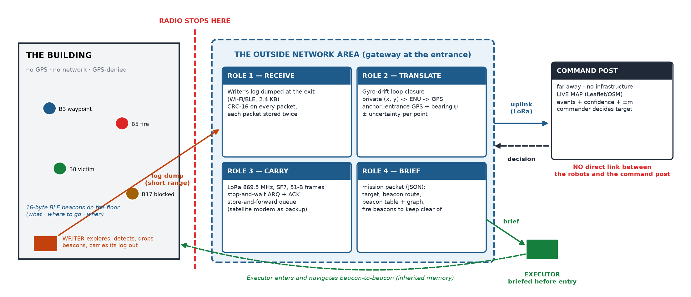
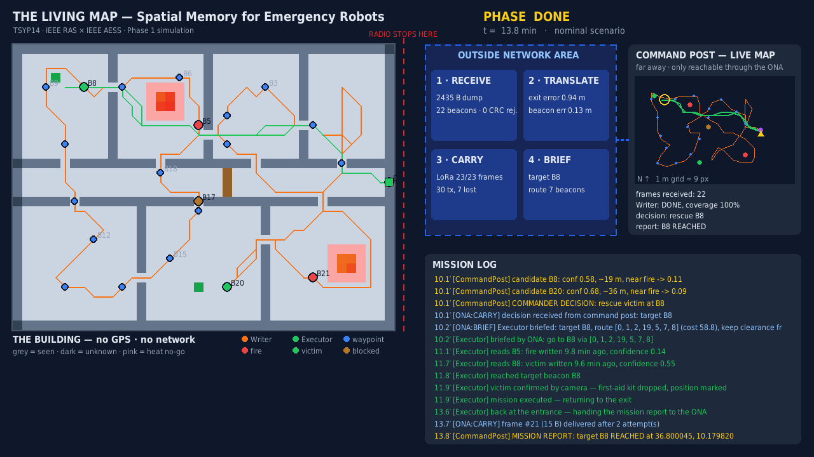

# The Living Map: Spatial Memory for Emergency Robots

**TSYP14 Technical Challenge, IEEE RAS × IEEE AESS Tunisia. Phase 1 submission. Team: Breadcrumb.**

📄 [Technical report (PDF)](https://drive.google.com/file/d/13rTJQrDnf328_f-pRUue5T5RUfhjJhbb/view?usp=drive_link) · 🎬 [Demo video — nominal mission](https://drive.google.com/file/d/13wUDenrrhLHDqce1rXyJ-KN1JE30OrPQ/view?usp=drive_link) · ⚠️ [Failure-scenario videos](https://drive.google.com/drive/folders/1OTsqPcSpbyh9yzK0YaqPVnGFP-aULrra?usp=drive_link)

A two-robot system that gives an unmapped, GPS-denied building its own memory:

1. A **Writer** robot explores a burning building on its own. It detects **fires, victims and blocked passages**, and
   leaves **16-byte radio beacons** saying *what* it found, *where to go* and *when* it was written.
2. It carries its log out past the point where radio stops.
3. The **Outside Network Area** gateway **receives** the log, **translates** the robot's private coordinates into
   GPS (with gyro-drift loop closure), **carries** them over LoRa to a distant **command post's live map**, and
   **briefs** the **Executor**.
4. The Executor enters with no map of its own and navigates beacon-to-beacon. It handles dead beacons, collapsed
   doorways and aging information, rescues the victim and reports back through the ONA.

**No direct link between the robots and the command post.** This is enforced by design and checked by a test.





## Highlights

| | |
|---|---|
| Writer autonomy | Frontier exploration + A*, heat no-go zones, battery-aware return (turns back while 1.3 × the cost to exit is still in the battery) |
| Events | Fire (thermal), victim (camera), blocked passage (lidar). Each gets a beacon; de-duplicated within 2 m. |
| Beacons | 16 B packet with CRC-16, `next_id` forming a tree toward the exit, per-event **message aging** (fire τ = 10 min, victim 30 min, blocked 2 h) |
| Frame translation | Private → ENU → WGS-84. **Gyro-drift loop closure** cuts the max beacon error from 0.70 m to 0.28 m. |
| Outside Network Area | CRC double-copy dump, 51-byte LoRa frames, ARQ + store-and-forward, Dijkstra briefing over the beacon graph with fire penalty |
| Executor | Beacon-to-beacon navigation, RSSI arrival / gradient search, dead-beacon and blocked-edge re-routing, recovery mode |
| Command post | Live Leaflet/OSM map with confidence, age and ± circles; automatic commander scoring |
| Failures | 6 injected scenarios, all survived (see [`docs/failure_cases.md`](docs/failure_cases.md)) |

## Install

```bash
python3 -m venv .venv && source .venv/bin/activate
pip install -r requirements.txt
```

`ffmpeg` is only needed for `--record`. `graphviz` (`dot`) is only needed to regenerate `docs/writer_fsm.png`.

## Run

```bash
python -m sim.main                          # interactive window — SPACE pause, + / - speed, ESC quit
python -m sim.main --fail beacon            # failure injection: beacon | block | writer | link | battery
python -m sim.main --headless               # mission log + results JSON in the terminal
python -m sim.main --record media/demo.mp4  # render the video
```

Each run writes `out/live_map.html`, the command post's live map; open it in a browser while the simulation runs. It
also writes `out/mission_brief.json` (what the Executor receives) and `out/results_<scenario>.json`.

## Tests

```bash
pytest          # 21 tests: packet/CRC/aging, frame maths, LoRa framing + ARQ, full mission, 5 failure scenarios
```

## Demo videos

Watch online: [nominal mission](https://drive.google.com/file/d/13wUDenrrhLHDqce1rXyJ-KN1JE30OrPQ/view?usp=drive_link) · [failure scenarios folder](https://drive.google.com/drive/folders/1OTsqPcSpbyh9yzK0YaqPVnGFP-aULrra?usp=drive_link). The same files are in `media/`.

| Video | Shows |
|---|---|
| [`media/demo.mp4`](media/demo.mp4) | Nominal mission end to end (66 s) |
| [`media/fail_beacon.mp4`](media/fail_beacon.mp4) | A beacon dies, the Executor re-routes |
| [`media/fail_block.mp4`](media/fail_block.mp4) | A doorway collapses after the Writer passed |
| [`media/fail_writer.mp4`](media/fail_writer.mp4) | The Writer dies inside; the Executor recovers its memory from the beacons |
| [`media/fail_link.mp4`](media/fail_link.mp4) | 45 % LoRa loss |
| [`media/fail_battery.mp4`](media/fail_battery.mp4) | Low battery: early return, partial map |

## Repository layout

```
config.yaml            scenario parameters (anchor GPS, sensors, link, timings)
sim/
  maps/building.txt    40×30 building (0.5 m cells): # wall, F fire, V victim, X debris, E entrance
  world.py             ground truth + sensor models (lidar, thermal, camera, BLE RSSI)
  robot.py             shared robot: occupancy map, odometry with gyro drift, planning
  writer.py            Writer: exploration, detection, beacon deposition, binary log dump
  beacon.py            16-byte packet, CRC, message aging
  beacon_graph.py      beacon navigation graph + fire-aware Dijkstra
  frame.py             private -> GPS, gyro-drift loop closure
  ona.py               Outside Network Area: receive / translate / carry / brief
  link.py, uplink.py   LoRa link model (ARQ, store-and-forward) + 51-byte frame codecs
  command_post.py      live map (Leaflet HTML) + commander decision
  executor.py          Executor: briefed / recovery navigation, mission, return
  scenario.py          the full chain + failure injection
  render.py, main.py   Pygame view, CLI, video recording
docs/                  architecture, data flow, beacon spec, frame translation, ONA design,
                       implementation plan, failure cases, figures (+ the scripts that generate them)
report/                6-page technical report (LaTeX + PDF)
media/                 demo videos and screenshots
tests/                 pytest suite
```

## Documentation

* Technical report: [Google Drive](https://drive.google.com/file/d/13rTJQrDnf328_f-pRUue5T5RUfhjJhbb/view?usp=drive_link) · [PDF in this repo](report/report.pdf)
* [Beacon message & signal design](docs/beacon_spec.md)
* [Frame translation](docs/frame_translation.md)
* [Outside Network Area](docs/ona_design.md)
* [Implementation plan](docs/implementation_plan.md)
* [Failure cases](docs/failure_cases.md)
