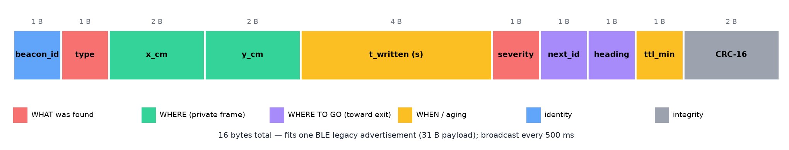

# Beacon Message & Signal Specification

The Writer drops a beacon at every event, every doorway and every 3 m of corridor. Each beacon keeps broadcasting one
**16-byte packet** that answers three questions: **what** was found, **where to go**, and **when** it was written.



## 1. Packet layout (little-endian)

| Byte | Field | Type | Meaning |
|---|---|---|---|
| 0 | `beacon_id` | u8 | Unique per mission (0 = the exit beacon at the entrance) |
| 1 | `event_type` | u8 | 0 waypoint · 1 fire · 2 victim · 3 blocked passage · 4 exit |
| 2–3 | `x_cm` | i16 | Position in the Writer's private frame (cm, ±327 m) |
| 4–5 | `y_cm` | i16 | Position in the private frame (cm) |
| 6–9 | `t_written` | u32 | Seconds since mission start (**when**) |
| 10 | `severity` | u8 | 0–255 detection strength (**what**): fire = 2·(T−25 °C), victim = camera score, blocked = 255 |
| 11 | `next_id` | u8 | Next beacon **toward the exit** (255 = none). The beacons form a tree rooted at the exit. |
| 12 | `heading_next` | u8 | Direction to `next_id`, 0–255 ↦ 0–360° (**where to go**) |
| 13 | `ttl_min` | u8 | Validity in minutes, per event type |
| 14–15 | `crc16` | u16 | CRC-16/CCITT (0xFFFF init) over bytes 0–13 |

Reference implementation: [`sim/beacon.py`](../sim/beacon.py). Every single-byte corruption is detected
(see `tests/test_beacon.py`).

## 2. Signal design

| Item | Choice | Why |
|---|---|---|
| Radio | BLE 5 legacy advertising (ESP32-C3), 2.4 GHz | 16 B fits the 31 B advertisement payload. No pairing; any robot can listen. |
| Period | 500 ms | A robot at 0.2 m/s hears a beacon about 10 times while passing it |
| Range | ~5 m line of sight indoors (TX power −4 dBm) | Long enough to link neighbouring beacons, short enough not to flood |
| Proximity | RSSI. "At the beacon" when the estimated distance is < 0.75 m | Executor arrival test and RSSI-gradient search |
| Energy | CR2032 coin cell, about 2–3 days at 500 ms advertising | Longer than any rescue mission |

## 3. Message aging

The **beacon never changes**. The reader computes trust from the packet age:

```
confidence(t) = severity/255 · exp(−age / τ_type)        and 0 when age > ttl_min
```

| Event | τ | TTL | Reasoning |
|---|---|---|---|
| Fire | 10 min | 30 min | Fire spreads and moves fast |
| Victim | 30 min | 90 min | A victim may move or be moved |
| Blocked | 2 h | 4 h | Structural changes are slow |
| Waypoint / exit | ∞ | 255 | Geometry does not age |

When a beacon is **stale**, its geometry is still used for navigation, but its event is shown as *unverified*. In the
simulation, the Executor reads *"fire written 9.8 min ago, confidence 0.14"*. The commander's decision changes as fire
information ages (compare the `none` and `link` scenarios: when the uplink is slower, the fire beacons drop below the
0.15 threshold).

## 4. Deposition rules (Writer)

1. **B0 (exit)** at the entrance before entering.
2. **Event:** a new fire, victim or blocked passage, de-duplicated within 2 m of a known event of the same type.
3. **Doorway:** the robot is between two walls (door or narrow passage) and no beacon is within 1.5 m.
4. **Breadcrumb:** 3 m driven since the last beacon.
5. **Stock management:** 24 beacons. The last 4 are reserved for events only.
6. **`next_id` choice:** among the beacons heard, the one with the shortest known distance to the exit. Otherwise the
   previously dropped beacon.
