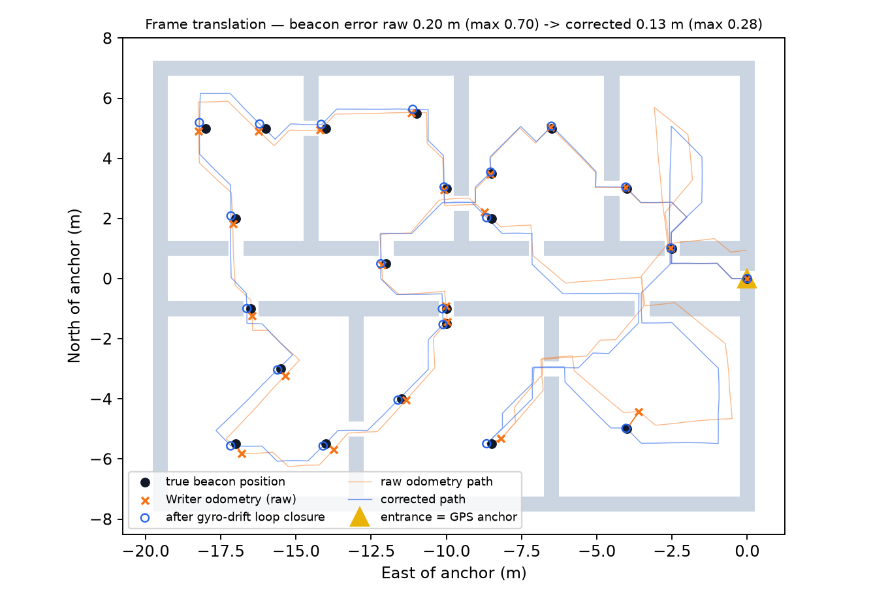

# Frame Translation: Private Robot Frame → GPS

## 1. Frames

| Frame | Origin | Axes | Who uses it |
|---|---|---|---|
| **Private** | Entrance point (where the Writer starts) | +x forward into the building, +y to the robot's left | Both robots, the beacons |
| **ENU** | Same point | East, North (metres) | ONA intermediate |
| **WGS-84** | — | latitude, longitude | Command post, live map |

Both robots start at the same entrance pose, so the Executor uses the beacons' private coordinates directly. Only the
ONA (outside, with GPS) has to know the real-world position.

## 2. Calibration (once, at the entrance, by the ONA)

* `lat0, lon0`: GPS fix of the entrance point (u-blox NEO-M8N, averaged for 60 s).
* `ψ`: bearing of the robot's +x axis, clockwise from true North. Measured with a compass + magnetic declination, or
  from two GPS fixes along the façade. In the simulation, ψ = 270° (the robot enters facing West).

## 3. Formula

```
North = x·cos ψ + y·sin ψ
East  = x·sin ψ − y·cos ψ
lat   = lat0 + (North / R)·180/π
lon   = lon0 + (East / (R·cos lat0))·180/π          R = 6 378 137 m
```

The flat-earth approximation error is < 1 mm over a 100 m building.

**Worked example** (in `tests/test_frame.py`): anchor 36.8000° N, 10.1800° E, ψ = 90°. Event at x = 10 m, y = 5 m →
North = 5 m, East = 10 m → **36.800045° N, 10.180112° E**.

## 4. Drift correction: gyro-drift loop closure (our method)

The Writer's odometry drifts. A cheap MEMS gyro adds a heading error that grows with time; in the simulation it is
0.012 °/s, i.e. ≈ 6° per 100 m at 0.2 m/s, plus a 1.5 % wheel scale error and noise.

Because the Writer **must come back to the entrance** to hand over its data, we get a free **loop closure**: its true
final position is (0, 0).

1. The ONA receives the full believed trajectory `(x, y, odometer)`, one point per move.
2. It searches for the heading drift rate **β (rad per metre driven)**. β is chosen so that re-integrating the
   trajectory with each step rotated by −β·odometer brings the end point back to (0, 0) (grid search + refinement).
3. Every beacon and event is moved by the correction of the trajectory point with the same odometer reading.
4. A heuristic ± uncertainty is attached to each point; it grows with the distance from the nearest end of the loop.
   The live map shows it as a circle.

**Simulation results** (nominal run, seed 7, see `fig_translation.png`):

| | Mean error | Max error |
|---|---|---|
| Raw Writer odometry | 0.20 m | 0.70 m |
| After gyro-drift loop closure | **0.13 m** | **0.28 m** |
| Average over 5 seeds (raw → corrected) | 0.25 → 0.20 m | 0.65 → 0.34 m |

The estimated drift rate was 6.08°/100 m. The true value is 6.0°/100 m.

> **What we tried first, and why it failed:** spreading the exit error linearly along the path (the classic
> "distribute the closure error" method) made the errors **worse** (0.25 → 0.40 m mean over 5 seeds). Heading drift *rotates* the
> path; it does not shift it linearly. Modelling the physical cause is what fixed it.


